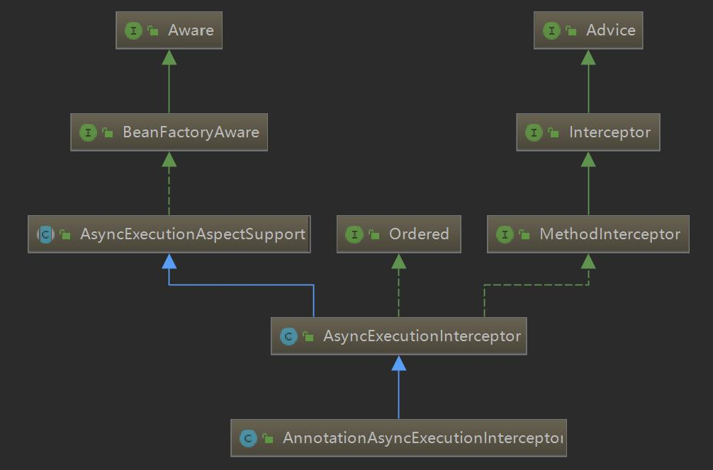

Interceptor是通用拦截器接口抽象，是个空接口；

MethodInterceptor是方法拦截器，有一个Object invoke(MethodInvocation invocation)方法，重写该方法可以在方法调用的前后，加入自定义逻辑，下面是源码中提供的例子

```java
class TracingInterceptor implements MethodInterceptor {
  Object invoke(MethodInvocation i) throws Throwable {
    System.out.println("method "+i.getMethod()+" is called on "+
                     i.getThis()+" with args "+i.getArguments());
    Object ret=i.proceed();//调用目标方法
    System.out.println("method "+i.getMethod()+" returns "+ret);
    return ret;
  }
}
```

AsyncExecutionAspectSupport是异步方法执行切面的基类，实现了BeanFactoryWare接口，可以获取Bean工厂，源码如下

```java
public abstract class AsyncExecutionAspectSupport implements BeanFactoryAware {

	//线程池默认bean名称
	public static final String DEFAULT_TASK_EXECUTOR_BEAN_NAME = "taskExecutor";


	//CompletableFuture类是否存在，这个类是java8引入的，这个字段doSubmit方法有用到
	private static final boolean completableFuturePresent = ClassUtils.isPresent(
			"java.util.concurrent.CompletableFuture", AsyncExecutionInterceptor.class.getClassLoader());


	protected final Log logger = LogFactory.getLog(getClass());

    //异步方法和对应线程池实例的缓存，因为每个异步方法可以指定线程池实例
	private final Map<Method, AsyncTaskExecutor> executors = new ConcurrentHashMap<Method, AsyncTaskExecutor>(16);

    //默认的线程池实例
	private volatile Executor defaultExecutor;

    //未捕获异常的处理器
	private AsyncUncaughtExceptionHandler exceptionHandler;

	private BeanFactory beanFactory;

	public AsyncExecutionAspectSupport(Executor defaultExecutor) {
		this(defaultExecutor, new SimpleAsyncUncaughtExceptionHandler());
	}

	public AsyncExecutionAspectSupport(Executor defaultExecutor, AsyncUncaughtExceptionHandler exceptionHandler) {
		this.defaultExecutor = defaultExecutor;
		this.exceptionHandler = exceptionHandler;
	}

	public void setExecutor(Executor defaultExecutor) {
		this.defaultExecutor = defaultExecutor;
	}

	public void setExceptionHandler(AsyncUncaughtExceptionHandler exceptionHandler) {
		this.exceptionHandler = exceptionHandler;
	}

	/**
	 * 重写BeanFactoryAware接口的方法，设置Bean工厂
	 */
	@Override
	public void setBeanFactory(BeanFactory beanFactory) {
		this.beanFactory = beanFactory;
	}


	/**
	 * 根据指定异步方法获取对应的线程池实例
	 */
	protected AsyncTaskExecutor determineAsyncExecutor(Method method) {
        //从缓存里面获取，如果获取得到直接返回
		AsyncTaskExecutor executor = this.executors.get(method);
		if (executor == null) {
			Executor targetExecutor;
            //根据方法获取线程池实例的Bean名称，@Async的value属性的值
			String qualifier = getExecutorQualifier(method);
			if (StringUtils.hasLength(qualifier)) {
                //bean工厂根据bean名称获取线程池实例
				targetExecutor = findQualifiedExecutor(this.beanFactory, qualifier);
			}
			else {
				targetExecutor = this.defaultExecutor;
				if (targetExecutor == null) {
					synchronized (this.executors) {
						if (this.defaultExecutor == null) {
							this.defaultExecutor = getDefaultExecutor(this.beanFactory);
						}
						targetExecutor = this.defaultExecutor;
					}
				}
			}
			if (targetExecutor == null) {
				return null;
			}
            //如果不是AsyncListenableTaskExecutor类型的线程池实例，构造一个TaskExecutorAdapter实例，TaskExecutorAdapter是带一个TaskDecorator属性的线程池实例，可以对要执行的任务进行装饰，比如SpringSecurity进行权限管理时，创建异步任务会丢失父线程的权限信息，可以写一个类实现TaskDecorator接口，在decorate方法里面往SecurityContextHolder设置上下文信息
			executor = (targetExecutor instanceof AsyncListenableTaskExecutor ?
					(AsyncListenableTaskExecutor) targetExecutor : new TaskExecutorAdapter(targetExecutor));
			this.executors.put(method, executor);
		}
		return executor;
	}

	/**
	 * 抽象方法，根据异步方法获取线程池bean的名称
	 */
	protected abstract String getExecutorQualifier(Method method);

	/**
	 * 根据bean名称获取Executor类型的线程池实例
	 */
	protected Executor findQualifiedExecutor(BeanFactory beanFactory, String qualifier) {
		if (beanFactory == null) {
			throw new IllegalStateException("BeanFactory must be set on " + getClass().getSimpleName() +
					" to access qualified executor '" + qualifier + "'");
		}
		return BeanFactoryAnnotationUtils.qualifiedBeanOfType(beanFactory, Executor.class, qualifier);
	}
	
    //获取默认的线程池实例
	protected Executor getDefaultExecutor(BeanFactory beanFactory) {
		if (beanFactory != null) {
			try {
				// 找TaskExecutor类型的线程池实例
				return beanFactory.getBean(TaskExecutor.class);
			}
			catch (NoUniqueBeanDefinitionException ex) {
				logger.debug("Could not find unique TaskExecutor bean", ex);
				try {
                    //找名称为taskExecutor的线程池实例
					return beanFactory.getBean(DEFAULT_TASK_EXECUTOR_BEAN_NAME, Executor.class);
				}
				catch (NoSuchBeanDefinitionException ex2) {
					if (logger.isInfoEnabled()) {
						logger.info("More than one TaskExecutor bean found within the context, and none is named " +
								"'taskExecutor'. Mark one of them as primary or name it 'taskExecutor' (possibly " +
								"as an alias) in order to use it for async processing: " + ex.getBeanNamesFound());
					}
				}
			}
			catch (NoSuchBeanDefinitionException ex) {
				logger.debug("Could not find default TaskExecutor bean", ex);
				try {
                    //找名称为taskExecutor的线程池实例
					return beanFactory.getBean(DEFAULT_TASK_EXECUTOR_BEAN_NAME, Executor.class);
				}
				catch (NoSuchBeanDefinitionException ex2) {
					logger.info("No task executor bean found for async processing: " +
							"no bean of type TaskExecutor and no bean named 'taskExecutor' either");
				}
				// Giving up -> either using local default executor or none at all...
			}
		}
		return null;
	}


	/**
	 * 执行异步任务，参数分别是异步方法执行逻辑、线程池实例、异步方法返回结果
	 */
	protected Object doSubmit(Callable<Object> task, AsyncTaskExecutor executor, Class<?> returnType) {
        //如果是Java8，使用CompletableFuture来执行异步任务
		if (completableFuturePresent) {
			Future<Object> result = CompletableFutureDelegate.processCompletableFuture(returnType, task, executor);
			if (result != null) {
				return result;
			}
		}
        //如果返回类型是ListenableFuture调用submitListenable
		if (ListenableFuture.class.isAssignableFrom(returnType)) {
			return ((AsyncListenableTaskExecutor) executor).submitListenable(task);
		}
        //如果返回类型是其他的Future类型，直接交给线程池执行
		else if (Future.class.isAssignableFrom(returnType)) {
			return executor.submit(task);
		}
		else {
            //直接不返回结果
			executor.submit(task);
			return null;
		}
	}

	//异常处理
	protected void handleError(Throwable ex, Method method, Object... params) throws Exception {
        //带返回值的直接抛出异常
		if (Future.class.isAssignableFrom(method.getReturnType())) {
			ReflectionUtils.rethrowException(ex);
		}
		else {
			//异常处理器处理异常，即使再出现异常也不抛出
			try {
				this.exceptionHandler.handleUncaughtException(ex, method, params);
			}
			catch (Throwable ex2) {
				logger.error("Exception handler for async method '" + method.toGenericString() +
						"' threw unexpected exception itself", ex2);
			}
		}
	}


	/**
	 * Java8下执行异步任务
	 */
	@UsesJava8
	private static class CompletableFutureDelegate {

		public static <T> Future<T> processCompletableFuture(Class<?> returnType, final Callable<T> task, Executor executor) {
            //如果异步方法返回值不是CompletableFuture类型直接返回null
			if (!CompletableFuture.class.isAssignableFrom(returnType)) {
				return null;
			}
            //调用CompletableFuture的supplyAsync方法去执行task任务
			return CompletableFuture.supplyAsync(new Supplier<T>() {
				@Override
				public T get() {
					try {
						return task.call();
					}
					catch (Throwable ex) {
						throw new CompletionException(ex);
					}
				}
			}, executor);
		}
	}

}
```

CompletableFuture类可以参考这篇文章 https://www.jianshu.com/p/abfa29c01e1d


下面看AsyncExecutionInterceptor这个类，这个类是处理异步方法调用的方法拦截器

```java
public class AsyncExecutionInterceptor extends AsyncExecutionAspectSupport implements MethodInterceptor, Ordered {

	public AsyncExecutionInterceptor(Executor defaultExecutor) {
		super(defaultExecutor);
	}

	public AsyncExecutionInterceptor(Executor defaultExecutor, AsyncUncaughtExceptionHandler exceptionHandler) {
		super(defaultExecutor, exceptionHandler);
	}


	/**
	 * MethodInterceptor重写的方法，方法调用前后处理一些逻辑
	 * the correct task executor and return immediately to the caller.
	 * @param invocation the method to intercept and make asynchronous
	 * @return {@link Future} if the original method returns {@code Future}; {@code null}
	 * otherwise.
	 */
	@Override
	public Object invoke(final MethodInvocation invocation) throws Throwable {
        //获取invocation的目标对象的class对象（被调用的异步方法所属对象的Class对象）
		Class<?> targetClass = (invocation.getThis() != null ? AopUtils.getTargetClass(invocation.getThis()) : null);
        //通过class对象和invocation的method获取Method
		Method specificMethod = ClassUtils.getMostSpecificMethod(invocation.getMethod(), targetClass);
        //没理解为什么还要再获取一次，我debug时候调用specificMethod.equlas(userDeclaredMethod)返回的是true
		final Method userDeclaredMethod = BridgeMethodResolver.findBridgedMethod(specificMethod);

        //通过method获取处理这个异步方法的线程池实例
		AsyncTaskExecutor executor = determineAsyncExecutor(userDeclaredMethod);
		if (executor == null) {
			throw new IllegalStateException(
					"No executor specified and no default executor set on AsyncExecutionInterceptor either");
		}

        //将异步方法封装成一个Callable对象
		Callable<Object> task = new Callable<Object>() {
			@Override
			public Object call() throws Exception {
				try {
					Object result = invocation.proceed();
					if (result instanceof Future) {
						return ((Future<?>) result).get();
					}
				}
				catch (ExecutionException ex) {
					handleError(ex.getCause(), userDeclaredMethod, invocation.getArguments());
				}
				catch (Throwable ex) {
					handleError(ex, userDeclaredMethod, invocation.getArguments());
				}
				return null;
			}
		};

        //把异步任务、线程池实例、返回值类型传进去，调用父类的AsyncExecutionAspectSupport的doSubmit方法
		return doSubmit(task, executor, invocation.getMethod().getReturnType());
	}

	/**
	 * 根据异步方法，获取处理该异步方法的线程池实例的bean名称，后续在BeanFactory里面根据这个名称获取线程池实例，本类中返回null，子类会重写这个方法，AnnotationAsyncExecutionInterceptor重写改方法是获取@Async注解的value值
	 */
	@Override
	protected String getExecutorQualifier(Method method) {
		return null;
	}

	/**
	 * 调用父类的获取默认线程池实例的方法，如果获取不到，使用SimpleAsyncTaskExecutor实例
	 * SimpleAsyncTaskExecutor这个线程池会为每个任务触发一个新线程，异步执行它，相当于没用线程池
	 */
	@Override
	protected Executor getDefaultExecutor(BeanFactory beanFactory) {
		Executor defaultExecutor = super.getDefaultExecutor(beanFactory);
		return (defaultExecutor != null ? defaultExecutor : new SimpleAsyncTaskExecutor());
	}

	@Override
	public int getOrder() {
		return Ordered.HIGHEST_PRECEDENCE;
	}

}
```

11